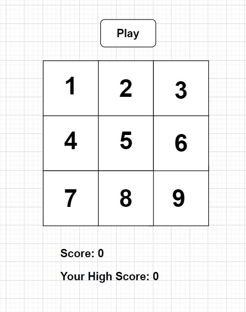
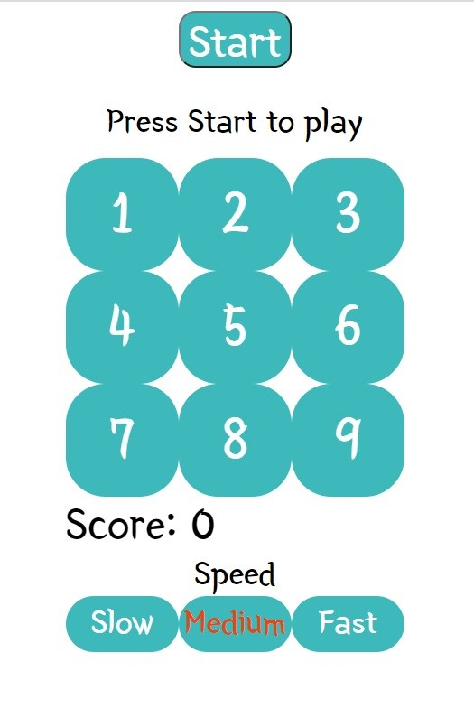
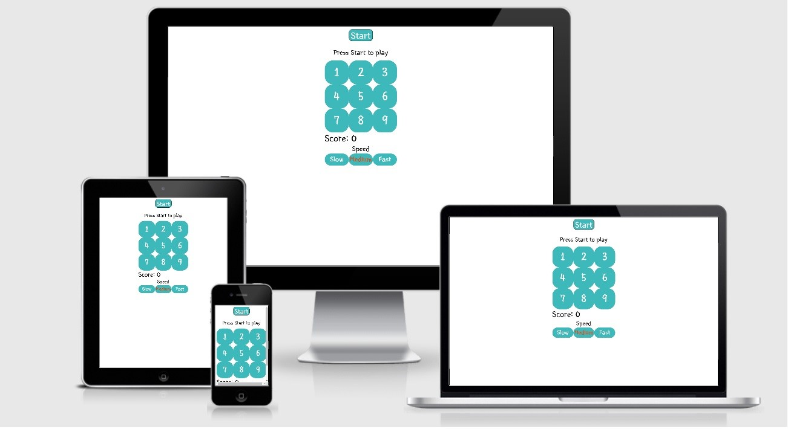

# Memory Game
This memory game is a milestone project, and a part of Full Stack Software Development program, which summarizes
Interactive Frontend Development module provided by Code Institute, an educational platform used by Canadian Business College.
It was created to help you improve your memory while having fun.

## UX
An inspiration for this project comes from a game I found on memozor.com, a free memory games website, where you can find a big variety of memory games with different styles.
 Link to the game: https://www.memozor.com/other-memory-games/numbers-memory-games/light-up-numbers
 I waned my game to be custom, so I decreased the quantity of numbers from 30 to 9 and added a Start button that starts the game.
The design of this game is very simple and user intuitive, which makes it easy to start playing right away. 

 The result of my work is very close to the original wireframe: 

### User Stories
As a player I want:
- The game to be playeble using my mouse and/or touchscreen.
- A large easy to press buttons.
- Rules of the game to be easy to understand.

## Features
-	The game has a fixed width of 300px that makes it responsive and suitable for playing on any device.
-	Very simple design makes it easy to start playing and doesn't require additional istructions.
-	You can choose your preffered speed level from 3 options available: Slow, Medium, Fast.
-	All buttons(except for 'Start' button) have a sound effect.
- The JavaScript code gives you a random series of numbers, which never repeats same nomber two times in a row.
- For thouse who love cheating I left a console.log function that loggs an array with ordered numbers you need to repeat.

## Features Left to Implement
-	Sound for 'Start' button.
- High Score.

## Technologies Used
-	HTML
-	CSS
-	JavaScript
- Jquery
-	GitHub
-	GitPod
-	Google Fonts
-	Draw.io

## Testing
Most of the testing was made manually during development process using Google Chrome Inspect tool.
One of the biggest issues I had while developing this game was implementing timeout inside for-loop inside my 'repeat' function. The length of myArray was increasing and I didn't know how to icrease a timeout accordingly. After hours of research and experiments with setTimeout and setInterval functions I've found a solution on [Stack Overflow](https://stackoverflow.com/questions/7749090/how-to-use-setinterval-function-within-for-loop).
 After playing the game over 100 times I've started noticing that even though JavaScript gave me a random number every time I played, it also was repeating the same number two or three times in a row very often and made my playing process less enjoyeble. I guess it was because 9 is not a big number to choose from (to be honest, I don't know much about Probability theory). After this discovery I made a decision to adjust my click function for 'playbtn' so it never repeats the same number two times in a row.
 To record players score I've used myArray.length in a 'score' function, but the problem was detected when I noticed that I could increase score just by clicking the Start button as it adds number with every click. To avoid it I've made a decision to disable 'Start' button for the time of playing. It enables again after the game is over. Also I've disabled buttons with numbers so that your game is not over even before you start it.
 Also I had some issues while implementing sound feture. First thing I did was accessing mp3 file from JS file, but while testing the game I've noticed that sound randomly doesn't play on fast speed mode and console gives 404 error. I've decided that the problem was the length or a size of my mp3 file. I've used https://audiotrimmer.com/ to decrease the lenght from 0.8s to 02s. And along with that I've decided to access file from HTML file instead of JS arter reading some advices on https://stackoverflow.com/questions/9419263/how-to-play-audio. After doing so the issue was resolved. However when I've tested the game on my Samsung S10 it still had few times when the sound dissapeared. I'm not sure why this is happening but the solution must be using The Web Audio API as mentioned erlier link advices.

 To make sure the site is responsive and working properly. I’ve done all possible actions on all types of available devices. All elements are working as they are expected.

Special thanks to http://ami.responsivedesign.is/ where I checked responsiveness on different types of devices.

CSS code was checked with [W3C CSS Validator](https://jigsaw.w3.org/css-validator/) and no errors were found. 
HTML code was checked with [HTML Validator](https://validator.w3.org/) and no errors were found. 
JavaScript code was checked with [Syntax Validator](https://esprima.org/demo/validate.html) and it says "Code is syntactically valid." However I've also checked my JavaScript code with [BeautifyTools validator](http://beautifytools.com/javascript-validator.php) it showed me a large number of unsignificant mistakes such as missing or unnesessary simicolon. I may have to come back to my JavaScript code in the future and make it more beautiful and easy to read.

## Credits
The idea for the game was taken from https://www.memozor.com/ - a website with huge selection of free memory games.
 The sound for clicking buttons was downloaded from https://www.myinstants.com/
 Special thanks to my teacher Usmaan Mujtaba (Canadian Business College) who consulted me during the process of creation this project.

